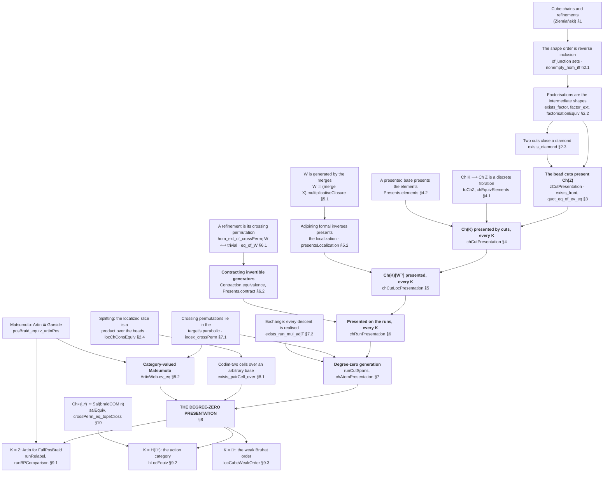

# BLUEPRINT — the presentation of `Ch(K)[W⁻¹]`

The dependency structure of the main theorem, at the granularity a paper would use. Names in
`code font` are the Lean declarations; the section numbers are the ones a write-up would carry.
Assumes familiarity with precubical sets and with presentations by polygraphs.

## The theorem

> Let `K` be a precubical set, `Ch(K)` its category of cube chains and refinements, and `W` the
> class generated by the bead merges. Then `Ch(K)[W⁻¹]` is presented by
>
> 1. **generators** the codimension-one, degree-zero refinements — the cuts out of a run;
> 2. **relations** identifying the two factorisations of each codimension-two, degree-zero
>    refinement.

`degree a = Σᵢ (dᵢ − 1)` on a chain with bead dimensions `dᵢ`, so degree zero means every bead is an
edge — a *run*; and `codim f = degree(tgt f) − degree(src f)`.

## The dependency graph

## Layer by layer

### §2 — the combinatorics of shapes

The chain order is entirely `boundaries`, mathlib's `Composition.boundaries` on the dimension list.

- `nonempty_hom_iff` — `a ⟶ b` exists iff `dimSum` agrees and `boundaries b ⊆ boundaries a`. The
  shape order **is** reverse inclusion of junction sets.
- `factorisationEquiv f : Factorisation f ≃ MidShape a b` — the factorisations of a fixed refinement
  are exactly the intermediate shapes, one each. With the previous line: **the factorisations of a
  codimension-`k` refinement form the Boolean lattice on the `k` junctions it drops**, a `k`-cube.
- `exists_diamond` — two cuts out of one shape close over any common coarsening.
- `locChConsEquiv`, `locOverEquivBase`, `locOverEquivWedge` — **the splitting**: for every `K` and
  every chain `c`, the localized slice over `c` is the *categorical product* of its beads'
  cube-localizations, hence of their weak orders. `locOverEquivBase` is what makes this
  `K`-independent, since `W K` is `W Zbp` pulled back along the fibration. No hypothesis on `K`;
  the `AdmitsAltitude` a concatenation needs is discharged for serial wedges.

### §3 — the base presentation

`zCutPresentation : Presents Cut.poly ((Ch Zbp)ᵒᵖ)`. Generators the codimension-one refinements,
relations the codimension-two ones read as two paths of length two with the same value. Completeness
is `exists_front` (standardization: push a chosen cut to the front of a word) followed by
`quot_eq_of_ev_eq`. **Not a confluence argument** — see *§11, dead ends*.

### §4 — lifting along the fibration

`toChZ K : Ch K ⥤ Ch Zbp` is a discrete fibration and `W K` is `W Zbp` pulled back, so a chain of
`K` is a shape plus a classifying map and a refinement upstairs is one downstairs carrying the
element. `Presents.elements` then presents the total category from the base, unconditionally in `K`.

### §5 — localizing the presentation

`W := (merge X).multiplicativeClosure` — *generated by* the bead merges, which is the precise form
of "we localize at a small class". `presentsLocalization` adjoins a formal inverse to each generator
in the picked class together with two cancellation cells, and proves the result presents the
localization. This is the step that avoids any calculus of fractions: none is available here.

### §6 — contracting onto the runs

Every chain is merged into from the run on its own events, canonically and choice-freely. The
coherence that makes the contraction well defined is that **two `W`-arrows with the same endpoints
agree** — `hom_ext_of_crossPerm` (a refinement is its crossing permutation) composed with
`W_iff_crossPerm_eq_one`. `Contraction.equivalence` is a statement about polygraphs alone;
`Presents.contract` reads it at a target. Note `Presents.restrict` cannot do this: convexity forces
closure under isomorphism, so it never reaches a skeleton.

### §7 — degree-zero generation (dimension one)

`index_crossPerm` puts a refinement's crossing permutation in the **parabolic** of the target's
blocks. Reduced words for a parabolic element use only letters of that parabolic, so every letter
swaps two events inside one bead — and a bead is a cube, which carries every 2-face, so the
witnessing square is a cell of `K`. Descent induction on `permLen` then peels one atom at a time.
Result: `chAtomPresentation K`, for every `K` with no hypothesis.

### §8 — degree-zero relations (dimension two)

Two inputs.

- `exists_pairCell_over` — the codimension-two cell over an **arbitrary** base chain, not just the
  coarsest. Its hypotheses pin the geometry: the hexagon quantifies over runs above `d`, so both
  transpositions lie in `d`'s parabolic, so `d` carries a bead of dimension three — a 3-cube of `K`.
  Where `K` has the two squares and no 3-cube the hexagon is never instantiated and only commutation
  is used, so no relation holds without a cell to derive it from.
- `ArtinWeb.ev_eq` — **Matsumoto with values in arrows rather than in a monoid**. On a set of
  permutations carrying an injective naming, with an arrow per ascent satisfying commutation and the
  hexagon, any two ascending paths between two objects compose alike. The monoid-valued `matsuLift`
  cannot serve, because at general `K` an atom runs between two *different* runs.

The commuting case is not geometry at all: non-adjacent cuts split the chain, and the relation is
the interchange law `(f,1) ∘ (1,g) = (1,g) ∘ (f,1)` of a product category.

### §9 — the named targets

| `K` | `Ch(K)[W⁻¹]` | how |
|---|---|---|
| `Zbp` | the positive braid monoid, graded by strand count | `runRelabel` is a polygraph isomorphism onto the Artin polygraph; `runBPComparison` links it to the chain |
| `H(□ⁿ)` | the positive braid action category on `Perm (Fin n)` | `hLocEquiv` |
| `□ⁿ` | the right weak Bruhat order on `Sₙ` | `locCubeWeakOrder` |

The two species of codimension-two cell give exactly the braid and the commutation relation
(`runSquare_artin`), which is the sense in which Artin's presentation is read off the geometry.

### §10 — the Salvetti reading

`salEquiv : Ch⋆(□ⁿ) ≌ Sal (braidCOM n)`, and `crossPerm_eq_topeCross` says our crossing permutation
*is* the arrangement's. A chamber is a run, its walls are the adjacent pairs, and a wall cell lies
*below* both chambers it separates — so an atom is the apex of a span and appears as an arrow only
after one leg is inverted. That the Salvetti complex models the complexified complement, whose `π₁`
is `Bₙ`, is classical and would be cited, not proved.

`H(□ⁿ)` is **not** a Euclidean precubical set: its `n!` top cells share their extremal vertices
(`H_obj_map_const`), while in `ℤᴺ` a cube is pinned by its minimum and maximum. That is a feature —
the ordering data is exactly what a Euclidean embedding cannot store.

## §11 — dead ends, recorded so they are not retried

- **The cut presentation is not a rewriting system.** A codimension-two cell is two factorisations of
  *one* refinement, so every additive invariant — letter count, codimension, crossing count — takes
  the same value on both sides. The only orientation left is by junction position. Its completeness
  is a standardization argument (`exists_front`), not confluence.
- **Newman does not apply to the coherence.** `Relation.LocallyConfluent.confluent` concludes
  *joinability of a relation on one type*; what is wanted is an *equation between arrows*. Putting
  the arrows into the relation makes joinability strictly weaker than the conclusion needed.
- **Tietze reduction is not confluent.** Deleting a generator can consume the witness another
  deletion needed, so there is no "Tietze normal form" to appeal to; and uniqueness of minimal
  presentations is the territory of Andrews–Curtis.
- **The presentation is not monoidal for the Day tensor** — `isEmpty_germ_mul`. A merge would have to
  land on an interchange square, which relates two words of the *same* length, and no germ relation
  does. What the wedge gives is a **categorical product**, which is all the argument needs.
- **The strict colimit over slices is not the bicolimit**, and the slice family cannot be induced by
  descent (`merge_fibres_clash`). The contraction route avoids the question by using no colimit.

## §12 — where a citation could replace a proof

Ranked by how much it would save.

1. **`ArtinWeb.ev_eq` (§8.2).** A category-valued Matsumoto/Tits theorem. Deligne's *Les immeubles
   des groupes de tresses généralisés* (Invent. Math. 1972) proves gallery coherence for Artin
   monoids in essentially this form; Tits's solution to the word problem is the other candidate. If
   either is citable as stated, §8.2 collapses to a reference.
2. **The contraction and restriction (§6, §8).** These are Tietze moves plus a 0-cell contraction.
   Gaussent–Guiraud–Malbos's *Coherent presentations of Artin monoids* (Compositio 2015) performs
   homotopical reduction in the same spirit; if their reduction covers the 0-cell case, §6 shortens.
3. **Matsumoto (§9.1).** `posBraid_equiv_artinPos` is proved in-tree but is classical and should be
   cited rather than reproved in the paper.
4. **Salvetti (§10).** The complex modelling the complexified complement is classical; only the
   identification `Ch⋆(□ⁿ) ≌ Sal` is ours.

**Squier's theorem does not bundle anything here.** It derives homological finiteness from a
*convergent* presentation, and no convergent rewriting system is used — see §11. It becomes relevant
only for the coherent-presentation and resolution story, which is separate work.

## §13 — what is not yet proved

- §8 at general `K`: the degree-zero **relations**. §7 (generation) holds for every `K`; the
  relations are proved at `K = Zbp` only.
- The asphericity that would make the degree filtration a polygraphic resolution; statements are
  recorded in `Concurrency/Presentation/ResolutionConjecture.lean`.
- Minimality of the generating set — that every generating set contains all `N−1` atoms, from
  `posLen` being additive and vanishing only at `1`.
